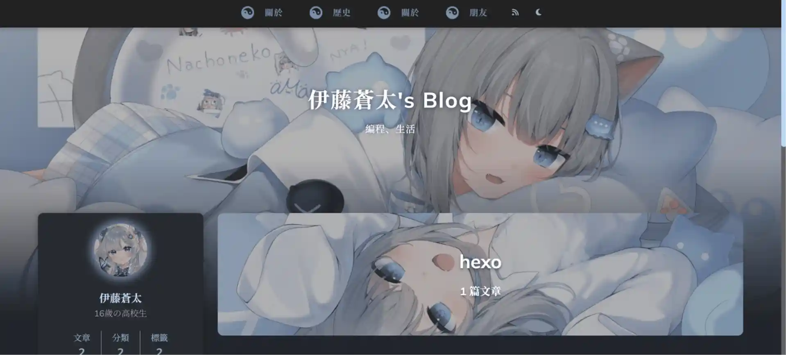

# itouBLoGa


個人技術部落格專案，使用 Hexo 靜態網站生成器基於 Reimu 主題構建。


## 專案結構

- `_config.yml` - Hexo 全站主設定
- `_config.reimu.yml` - Reimu 主題設定
- `themes/reimu/` - 主題原始碼與佈局
- `source/` - 網站內容來源
  - `source/_posts/` - 文章 Markdown
  - `source/about/`, `source/friend/` 等靜態頁面
- `public/` - Hexo 生成後的部署檔案

## 主要功能

- 深色/淺色模式支援
- RSS/Atom Feed（`atom.xml`）
- 搜尋、分類、標籤、網站地圖
- Waline 留言系統支援
- Mermaid、MathJax 數學公式、代碼高亮

## 本機開發

```bash
npm install
npm run server
```

預設會啟動 Hexo 本機伺服器，可以在 `http://localhost:4000` 預覽。

## 產生靜態檔案

```bash
npm run build
```

生成結果會輸出到 `public/` 目錄。

## 清除和部署

```bash
npm run clean
npm run deploy
```

> 部署前請確認 `_config.yml` 與主題設定檔正確填寫。

## 重要配置

- `theme: reimu` - 使用 Reimu 主題
- `dark_mode.enable: true` - 預設啟用深色模式
- `feed` 設定已啟用 `atom.xml`
- `hexo-generator-feed` 已納入相依套件

## 常見問題

- `Cannot GET /atom.xml`：請先執行 `npm install`，再執行 `npm run build` 生成 feed。
- 若想切換主題配置，請修改 `_config.reimu.yml`。

## 版權與授權

此專案主要為個人部落格範例，內容與樣式可依需求修改。
